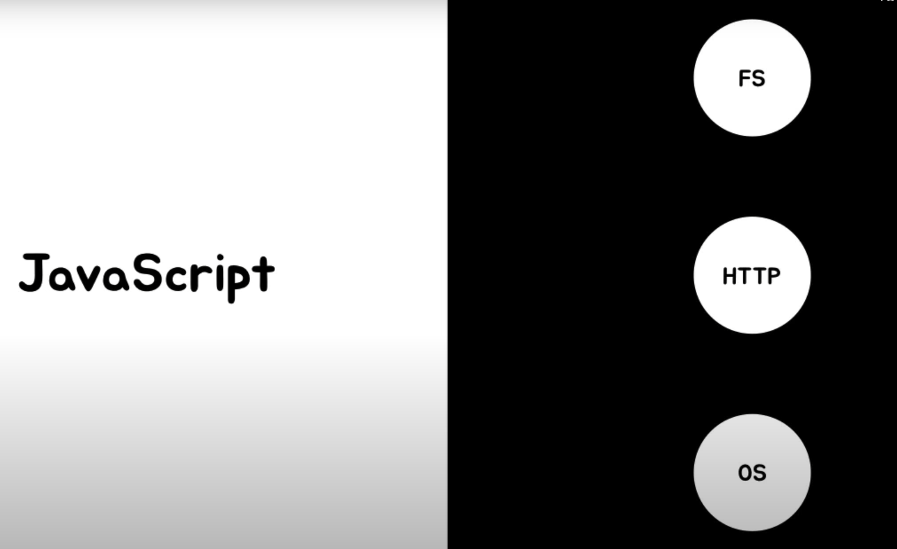
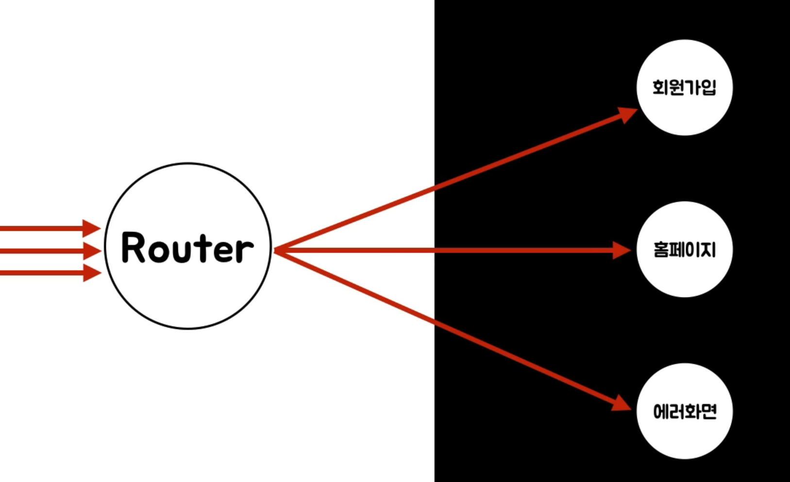

# JS - Express 설치

- npm init을 이용하여 현재 디렉토리를 npm의 디렉토리로 지정함
- npm install --save express : npm이 express package를 다운로드 받음
- express를 다운로드 받으면 package.json의 dependency 안에 생김.

# Express 웹 앱 만들기
- 메뉴얼을 통해 문제를 해결하는 방법을 기르기.
- https://expressjs.com/
- app.js 라는 파일을 만듬. (application 최초로 실행된, 최초의 진입점인 애플리케이션) -> main application, main file

## app.js
```
const express = require('express');
const app = express();

app.get('/', (req, res) => {      // 사용자가 루트로 들어왔을 때req, res 약속
    console.log('Hello Home page');
});

app.get('/login', (req, res) => {      
    console.log('Login please');
});

app.listen(3000, () =>{        //3000번 포트를 받아서, 콜백하여 connect 찍음
    console.log('Connected 3000 port!);
})
```
- app.get() : get이라는 메서드는 라우터이다. 즉, 어떤 요청이 들어왔을 때 길을 찾아주는 것이다.

<hr>

## Node.js-Javascript
- FS : 파일 시스템
- HTTP : 네트워크를 통해 어떠 한 일을 하는
- OS : 운영체제를 제어하는

<hr>
<br>

### Module-NPM

<hr>
<br>

### Router와 Controller

<hr>

## 연결 하는 것들
- Javascript
- Npm
- Router

## 연결할 대상을 주는 것
- Nodejs
- Module
- Controller

# Express, 정적 파일을 서비스 하는 법
- 정적 파일 : 동적이지 않은 것(사람이 만들어진 것이 언제나 똑같이 보이면 정적이라고 함.)
- 동적 정보 : 프로그래밍 적으로 만들어진 정보들

#### app.use(express.static('')); -> 정적인 파일이 위치할 디렉토리를 지정하는 기능
